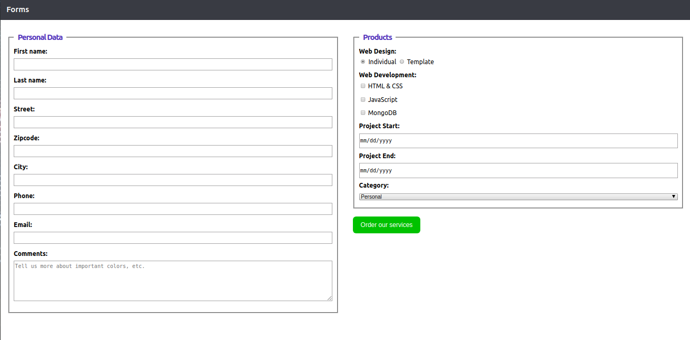
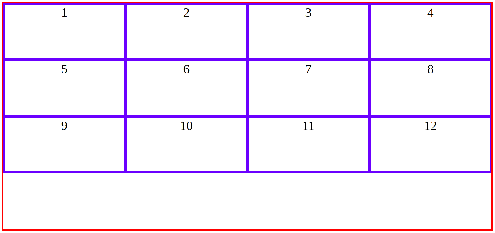
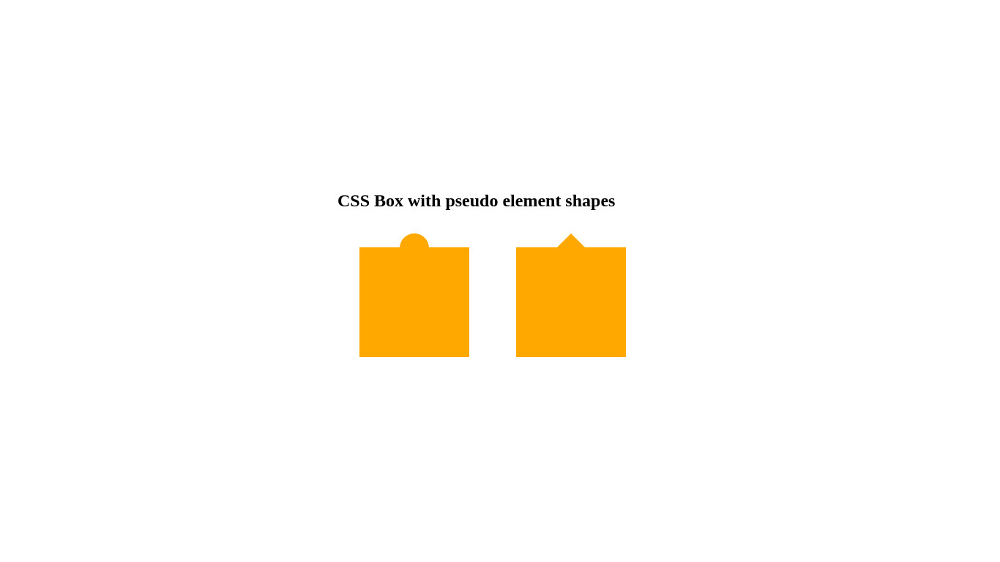
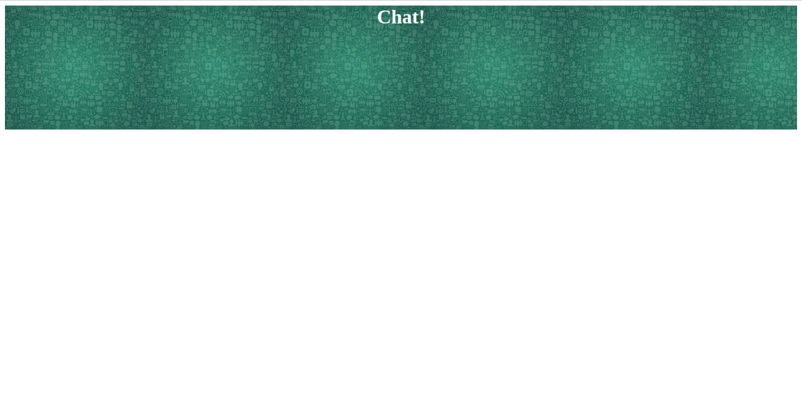

# Exercises - just for practise

# Sassy Website (uib framework variables)

Create a mockup website as seen in the [reference image folder](Exercises/UIB-framework-variables-sassy/images_reference). 

* Use sass to create the mockup. 
* Make use of nesting and variables where possible.
* Make sure to design for mobile first! 
* Breakpoints:
    - 768px - tablet 
    - 1024px - desktop
* Colors for styling: 
    - Card background color: #e0ddb2
    - Card and aside borders: #dad6ab
    - Color used for nav and footer: #016690
* Use the images in the [images folder](Exercises/UIB-framework-variables-sassy/src/images) for the header and cards.

Created: 25.08.2020

# Benny's burger (UIB framework bootstrap bennys burgers)

> Let's use Bootstrap to create a restaurant page!

## Desktop:

* site header is sticky to the top 
* add scroll to section - on click on the items in the menu, scroll to section

## Tablet

## Mobile

## Customize Bootstrap

Let's customize the site!

* set a custom primary color
* set a custom font family: https://fonts.google.com/specimen/Love+Ya+Like+A+Sister
* set a custom size for display headlines
* customize the space between `form-group`-s
* increase lead size
* remove rounded borders across the entire site
* change card border to primary color

Note: have a look into the `node_modules/scss/bootstrap/_variables.scss` file to see what variables you need to target to set your custom values.

Created: 19.08.2020 

# Swagger (uib-data-swagger)

* Create a form as shown in the reference images below. The form should have four fields total:
    * First name
    * Last name
    * Email
    * Message

* The input fields with the type of "text" should have a pink outline on focus. The input field with the type "email" and the text area should have a blue outline on focus. Make sure to select the inputs by type when styling for focus. 

* The form should also have a checkbox which is styled as a toggle switch. 

* At the end of the form, there should be an input for submit. This input field should be disabled.

**Rules**
* The form should be responsive. 

Created: 17.08.2020

# Strapping (bootstrap)

* Create a simple page using bootstrap!
Use the mockup image as a guide.
* Your page must include: a banner, a navigation bar, a simple grid system and cards!
* You shouldn't have to use _any_ CSS to make this page!
* Refer to bootstrap documentation for more info.

My result: https://itsanytime.github.io/DCI_Exercises/Exercises/bootstrap/

Created: 12.08.2020

# Basic Data Exercises

## Styling Forms (UIB-data-stylingforms)

1.  Create a basic HTML page with all important elements.
2.  Look at the mockup image. Create a form and style it like the mockup.
3.  Use the provided images in the img folder.

My result: https://itsanytime.github.io/DCI_Exercises/Exercises/UIB-data-stylingforms/

Created: 11.8.2020

## Exercise: Form 1  (UIB-data-form)

1.  Create a form wherein a user can input their details and choose their respective skills. See the image for the input fields, skills and design of the form.

Bonus: responsive

My result: https://itsanytime.github.io/DCI_Exercises/Exercises/UIB-data-form/forms.html

Created: 10.8.2020

### Grid 12 Boxes

Started

#### Task 1:

*   Make the parent element a grid container.
*   Set 4 rows and 4 columns of equal size on the container. Make sure that they take up `ALL available space`.
*   Give all items a border.

#### Task 2:

You NOW have an empty row at the bottom of your container. Select items and span them across columns and rows in order to fill that empty row.

* **Note**: only span 2 columns OR 2 rows at a time.

*   Images for reference:
    
    

    ### Rules

    -   This is an individual assignment.
    -   Deadline: 1 hour.
    -   Use **Git properly**
    -   Feel free to document your code with comments.

Created: 10.8.2020

 

started

## Sports Grid (UIB-layout-grid-parent)

**Instructions**: 
* Nest all the sports images from the [assets folder](/Exercises/UIB-layout-grid-parent/assets) into the main element with the class `container`. 

* Make the main element a class container that three columns of equal size, taking up all available space.

* Add a grid gap. 

* Comment out the original container sizing and add the following sizes to the columns: 
    - Col 1 - min-size: 100px, max-size: 350px
    - Col 2 - 1 fraction
    - Col 3 - min-size: 100px, max-size 350px

Created: 10.8.2020

## Basic Interaction Exercises

### CSS Animation tasks (animations)

started. 1-5 check solutions, 6 started

1. Add a 2 second animation for the div element, which changes the color from red to blue. Call the animation 

2. Specify that the transition of the 
 element should have a "ease-in-out" speed curve.
Add the following 5 steps to the animation "example" (using 0%, 25%, 50%, 75%, and 100%): 
    
     a.	0% - Set background color to "red", left position to "0px", top position to: "0px"
    b.	25% - Set background color to "blue", left position to "0px", top position to: "200px"
    c.	50% - Set background color to "green", left position to "200px", top position to: "200px"
    d.	75% - Set background color to "yellow", left position to "200px", top position to: "0px"
    e.	100% - Set background color to "red", left position to "0px", top position to: "0px"

3. Specify that the animation of the div element should have a "1" second delay before starting.

4. Specify that the animation of the div element should continue to loop for ever.

5. Specify that the animation of the div element should alternate between running forwards and backwards.

6. Edit the code to make the divs' background color fade in and out infinitely when a user's mouse hovers over the respective element.

7. Add a 2 second transition effect for background, and transform changes of the 
 element.HTML:

CSS:
div {
  width: 100px;
  height: 100px;
  background: red;
}div:hover {
  background: blue;
  transform: rotate(180deg);
}

8. Using the transition shorthand property, specify width changes for the 
 element should have:
"2" second duration, "ease-in-out" speed curve, and a "0.5" second delay before starting.HTML:

CSS:
div {
  width: 100px;
  height: 100px;
  background: red;
}div:hover {
  width: 300px;
}

Created: 23.07.2020

### Do have some fun with Pseudo Elements (pseudo elements)

NOT started

**Task** 
* Create two divs with the class `box`. 
* Add one more class to each div `with-circle` and `with-triangle`
* Use the css-pseudo elements `::before` and `::after` to create one circle and one triangle.
* Set position to abolute for circle and triangle and move them on the top of box as shown in reference image below.

Created: 23.07.2020

## Basic_CSS_Exercises

### I'm so fancy (fancy-shapes)

Redo

**Task 1** 
* Create a section with the class `task-one`. 
* Inside the section, add `lorem ipsum` text of around 30 characters. 
* Use the css-pseudo selectors `:before` and `:after` to add "Once upon a time ..." before the text and "...The end." after the text.

**Task 2**
* Create a section with the class `task-two`. 
* Use the `beach.jpg` image in the assets folder as a background image for the section element. 
* Change the shape of the element from a box-shape to a rhombus-shape.

**Task 3**
* Create an image element with the class `task-three`. Add the `smiley.jpg` image to the image element. 
* Rotate the image 180 degrees to show the smiley upside-down.

Created: 22.7.2020

### 7 Boxes (UIB layout flexseven)

1. Refresh your Flexbox skills with this fun game [flexboxfroggy](http://flexboxfroggy.com)

2. Create 7 Boxes with Flexbox & Mediaqueries.

3. There are 7 boxes on the page, each has a color. Style the boxes as follows:

   * 0px-600px: boxes 1-7 should each take up 100% of one row

   * 601px-800px: boxes 1 and 2 should each take 100% of one row, 3, 4 and 5 should each take up 33.33% of 1 row, and 6 and 7 should each take up 100% of one row

   * 801px +: boxes 1 and 2 should each take up 50% of one row, 3, 4 and 5 each should take up 33.33% of 1 row, and 6 & 7 should each take up 50% of one row

Images for reference:

   

#### Rules

-   This is an individual assignment.
-   Deadline: 1 and 1/2 hours.
-   Use **Git properly**
-   Feel free to document your code with comments.

My result: https://itsanytime.github.io/DCI_Exercises/Exercises/UIB-layout-flexseven/main.html

Created: 21.7.2020

### Breaking the flow (UIB layout break out the flow)

1. Create an empty box with the class of `halloworld`. The box should have a width and height of 200px. Inside the box, add the text "Hallo World" and change the background color to orange.

2. Center the `halloword` box in the middle of the screen.

3. Move the `halloworld` box 5 pixels to the left and 7 pixels down from the center position.
**Hint**: For centering elements in HTML try using the margin property. 

4. Add another square box with the class of `box1`. The box should have a width and height of 200px and a red background color. Position the box at the bottom-left of the screen.

5. Add another square box with the class of `box2`. The box should have a background color of rgb(0, 255, 85) and a height and width of 200px. This box should be positioned at the bottom-left of the screen, but should be 10px higher and 10px more to the right than `box1`.

6. Add a third box with a class of `box3`. It should have a background color of rgb(0, 183, 255). It should be positioned at the bottom-left of the window, but should be 10px higher and 10px further right than `box2`. 

7. Place `box3` **behind** `box2`.

My result: https://itsanytime.github.io/DCI_Exercises/Exercises/UIB-layout-break-out-the-flow/

Created: 21.07.2020

### Flexbox: Responsive Navigation Bar

NOT finished

Create a page with a navigation bar at the top that is horizontal and right-aligned on screens larger than 800px, horizontal and evenly spaced on screens between 500px and 800px, and laid out in a column on smaller screens.

Created: 20.07.2020

NOT finished

### Movie Genres (UIB layout out of ordinary)

1.  Create a section with the class `genres`. Make it a flex-container.
2.  Inside the flex-container, create 6 sections with the following content and background-colors. They should be created in the following order:
    - Action → dodgerblue
    - Thriller → rgb(190, 178, 178)
    - Comedy → rgb(255, 214, 30)
    - Horror → black
    - Drama → darkgrey
    - Romance → red
3.  For each section, center the font.
4.  Each flex-item should have a basic width of 500px and a fixed height of 100px. By default, each flex-item should take up all extra space.
5.  Now, make an exception for "thriller" and "comedy", Both sections should take up 10 times the amount of extra-space of their adjacent element.
    
**Hint**: Consider using flex-wrap.

Created: 20.07.2020

### Layout Planning  (without computer)

* Create a **rough** pen and paper layout for mobile, tablet and desktop for the same site. 

* The site must include: 
    - A header
    - A nav bar 
    - Cards containing info 
    - Footer  

Created: 20.07.2020

### Let's make a webpage! (berlin)

NOT 100% ready

The image assets you need to create the page below can be found in the <a href="/Exercises/berlin/assets">assets directory</a>.

Website:

#### Working with the browser developer tools

As you check what your HTML looks like when the browser renders it, familiarize yourself with the browser's developer tools. They allow you to inspect your HTML and CSS and try out changes! If you're using Chrome, you can learn more about its dev tools [here](https://developers.google.com/web/tools/chrome-devtools/inspect-styles/?utm_source=dcc&utm_medium=redirect&utm_campaign=2016q3).

##### BONUS: Part 2

As a next step let's make our webpage display nicely on phones.

**_NOTA BENE_**: Try do not use `display: flex` or `display: grid` for this project. We will discuss Flexbox and Grid in due course. For now, please stick to the techniques discussed [here](https://www.w3schools.com/css/css_positioning.asp).

My result: https://itsanytime.github.io/DCI_Exercises/Exercises/berlin/

Created: 16.07.2020

### Flex (UIB layout flex)

* 01: Use flexbox to align all divs in a row. Use wrap so that the divs appear on multiple rows. Center the rows in the container
* 02: Use flexbox to align the divs in a row. Reverse the order of the divs.
* 03: Use flexbox to display all divs in a column in reverse order on the center of the page. 
* 04: Use flexbox to display all divs in a row at the bottom of the container. Make the divs only take up one line.
* 05: Use flexbox to display the divs on one row in the center of the container.
* 06: Use flexbox to display all divs in one column in the center of the page.

**Note**: Instructions can also be found in the css file for each exercise. 

My results:
https://itsanytime.github.io/DCI_Exercises/Exercises/UIB-layout-flex/challenges/01/
https://itsanytime.github.io/DCI_Exercises/Exercises/UIB-layout-flex/challenges/02/
https://itsanytime.github.io/DCI_Exercises/Exercises/UIB-layout-flex/challenges/03/
https://itsanytime.github.io/DCI_Exercises/Exercises/UIB-layout-flex/challenges/04/
https://itsanytime.github.io/DCI_Exercises/Exercises/UIB-layout-flex/challenges/05/
https://itsanytime.github.io/DCI_Exercises/Exercises/UIB-layout-flex/challenges/06/

Created: 14.07.2020

### What's your background? (UIB boxmodel backgroundimages)

**Note**: The task starting files can be found in the corresponding folder names. Each task folder contains the necessary assets.

* Task 1: Add the `background.jpg` in the assets folder as a background image to the header. Set the size to contain and make sure the image repeats across the header. 

* Task 2: Add the background images in the assets folder to each of the sections with the classes of `info-1`, `info-2` and `info-3` (make sure to use a different image for each section). Set the size of the background to cover the whole section element. Make sure that the background does not repeat and that the position is set to bottom. Make sure that you **DRY**.  

**Bonus for task 2**: 
* Add padding to the sections. 
* Make the sections appear side-by-side. 
* Add a border radius to the sections.

My results: 
https://itsanytime.github.io/DCI_Exercises/Exercises/UIB-boxmodel-backgroundimages/task-1/
https://itsanytime.github.io/DCI_Exercises/Exercises/UIB-boxmodel-backgroundimages/task-2/

Created: 14.07.2020

### Design Mockup (piano page)

Use the given images, create a page that looks like the design-mockup:

My result: https://itsanytime.github.io/DCI_Exercises/Exercises/piano_page/

Created: 14.07.2020

NOT Finished 

### They see me scrolling (UIB boxmodel flow)

**Task 1**
* The sections with the class `esports-info` need to be styled. 
* First of all, give each section a set height and width.
* Give each section a border. 
* Set the size of the images. 
* Allow the user to scroll through the information on each section. 

**Task 2**
* Make the image and paragraphs in the section with the class `esports-tournaments` appear side-by-side using float. 

My result: https://itsanytime.github.io/DCI_Exercises/Exercises/UIB-boxmodel-flow/

Created: 13.07.2020

### Model the Boxes (UIB boxmodel modellingboxes)

1. Create `html` and `css` files. Work from there.

2.  Create the layout shown in the image below:
   
    

3.  Use `<header>`, `<main>`, `<footer>`, `<aside>` to structure the html page.

My result: https://itsanytime.github.io/DCI_Exercises/Exercises/UIB-boxmodel-modellingboxes/

Created: 13.07.2020

### Contain Yourself (UIB boxmodel containing)

* Style the header so that is takes up 100% of the viewport height. 
* Add the `container.jpg` image from the [images folder](/Exercises/UIB-boxmodel-containing/images/) to the `img` tag found in the header.
* Style the image to take up 100% width and height of the header. 

* Give the `main` element a class of `container`. 
* Choose a font from google fonts and apply it to the page.
* Select the `container` class. Give it a width of 80% and center it in the middle of the page.

My result: https://itsanytime.github.io/DCI_Exercises/Exercises/UIB-boxmodel-containing/

Created: 13.07.2020

### Block vs. Inline: (same folder name)

    Create an index.html file with 3 paragraphs, each containing the words “This is a paragraph”.
    Draw a border around each element.
    In one of the paragraphs, enclose one word in <em> tags and another one in <strong> tags.
    Inspect a paragraph in DevTools. Change its width and height.
    Inspect the <em> element in DevTools.  Try to change its width and height.  What do you notice?
    Now set the display property of the <em> element to “block” and try again to change its width and height.  What do you notice?
    Change the display property of the paragraphs to “inline”.
    Inspect a paragraph with DevTools and try to change margin and padding.  What changed?
    Undo the changes to the display properties.
    Wrap all elements in a <main> element and give <main> a width of 80%.
    What can you infer about the default width of block-level elements like paragraphs?
    Change the display property of the <em> and <strong> elements to “block”.  Change their margin and padding.  Now change the display property to “inline-block”.  How does this differ from “display: block” and “display: inline”?
    Give the <em> and <strong> elements a display property of “inline” and the paragraphs a display property of “block”.
    Give a paragraph a width of 300px and a padding of 20px.  Inspect the result with DevTools.  Which of the boxes associated with this paragraph  (content-box, padding-box, border-box, margin-box) has a width of 300px?
    (Bonus) Ensure that, for any (current or future) element on this page, width applies to the border-box.

My result: https://itsanytime.github.io/DCI_Exercises/Exercises/block_vs_inline/

Created: 13.07.2020

### Language Placeholder

#### directions (same folder name)

-   Center all headings.
-   Justify all paragraph elements.
-   Convert the direction of the Arabic text to be read right-to-left.

My result: https://itsanytime.github.io/DCI_Exercises/Exercises/directions/

Created: 9.7.2020

**Bonusaufgabe:** pseudo, clip-path, writing-mode (pseudo+clip-path+writing-mode)

Create the CSS.style, without changing the html. Using pseudo classes. 
It shall look like the reference.png picture

Goal:  

Before:  

My result: https://itsanytime.github.io/DCI_Exercises/Exercises/pseudo+clip-path+writing-mode/

Created: 9.7.2020

### Shopping List (style_text2)

-   Choose a font on google fonts. Select different font weights e.g. light, regular, bold. Apply the font to all the elements on the page.
-   Create a stylesheet and work from there.
-   Underline the h1 heading.
-   Give all list items a light font weight.
-   Give all headings with the class of `heading` a shadow and, in CSS, make all these elements appear uppercase.
-   Give the element with the class of `note` a bold font weight. Make the text appear italic.
-   Strike through all the elements with the class `todo-item`.

My result: https://itsanytime.github.io/DCI_Exercises/Exercises/style_text2/

Created: 9.7.2020

## Basic Typography Exercises

### Exercise: Text styling and formatting (stylish_text)

-   Change the `body`'s font color and font family. Use a fallback system.
-   Change the headings' font family, use a fallback system and make them bold.
-   Make the `<h1>` 3 times the size of the base font-size.
-   Make the `<h3>` 1.5 times the size of the base font-size. Center this element.
-   Make the `blockquote`'s text italic.
-   Cross out the ``.
-   Make the `<em>`'s words all start with a capital letter.
-   Make the `<strong>` element all capital and bold.
-   Change the color of the link and remove its underline.

**Bonusaufgabe**:

-   Decrease the space between the `<h3>`'s letters and increase the space between its words.
-   Add more space between the `blockquote`'s lines.

My result: https://itsanytime.github.io/DCI_Exercises/Exercises/stylish_text/

Created: 9.7.2020

### Make your fonts awesome! (fontawesome)

-   Link font awesome to your html page.
-   Add a font awesome icon to the front and back of the h1 heading.
-   Center and underline the h1 heading.
-   Center the element with the class `review`. Give this element text shadow and display the text as uppercase.
-   Add icons to the front of each paragraph element nested in the sections with the class `info`.
-   Add appropriate icons after each possible review.

*   Desktop
    

My result: https://itsanytime.github.io/DCI_Exercises/Exercises/fontawesome/

created: 9.7.2020

### Exercise: CSS Selectors 1 (same folder name)

1. Select all h3 elements and change the elements' color to blue.
2. Select list items 3-5 in task 2 using classes. Change the elements' color to red.
3. Select the sibling of the first image using a combinator. Give the image a border.
4. Select the link ending in .com with an attribute selector. Give it a yellow background color.
5. Give "Task 5" (_this_) list item an id and change the color of the text.

My result: https://itsanytime.github.io/DCI_Exercises/Exercises/css_selectors_1/

Created: 7.7.2020

### Descendant Selectors (same folder name)

1. Modify the given page to make it look like the mockup.

My result: https://itsanytime.github.io/DCI_Exercises/Exercises/descendant-selectors/

Created: 6.7.2020

#### Used:

classname em
div .classname:first-of-type em
p:nth-child()
div:nth-child(odd)
div:nth-child(even)

### CSS Pseudo Classes (same folder name)

1.  Create an empty HTML page with charset, title, etc.
2.  Add buttons for 3 search engines of your choice, using different colors.
3.  Add a list of links to 3 articles about web stuff that you like. Make sure that the articles open up in a new tab.
4.  Use the pseudo classes for all elements, to enhance usability.
5.  Add some additional styling to your page e.g. background colors.

My result: https://itsanytime.github.io/DCI_Exercises/Exercises/css_pseudo_classes/my_solution/

Created: 6.7.2020

#### Used:

CSS: 
 
color 
background 
border-color 
text-decoration 
background-color 
text-align 
margin-top 
font-family 

.class {} 
a:hover {} 
a:visited {} 
a:link {} 
body {} 
body button {} 
input[tpye=button] {} 
h1, h2 {} 

 
HTML: 
p 
button 
class 
links 
link target (_blank) 
article 
cursor

### Assignment pseudo_classes (assignment 06072020)

    1. all paragraphs with a class of “dull” 
    2. all elements that have both a “todo” class and an “urgent” class
    3. all elements with a “todo” class or an “urgent” class or both
    4. all first paragraphs within <article> tags
    5. all links that have been visited
    6. the first line of any paragraph in any article element
    7. the first line of the first paragraph in any article element
    8. all paragraphs inside articles in the body
    9. all paragraphs inside elements with class “box”
    10. all paragraphs that are children of article elements
    11. all images that immediately follow paragraphs
    12. all images that are siblings of paragraphs
    13. all list items with class attribute “special” that are children of unordered lists

Created: 6.7.2020

### table of contents (same folder name)

1. Add a unique id to each heading tag in the page, make the id as descriptive as possible.

2. Wrap the text in the table of contents in an ordered list so that each main heading and its sub headings are in the same list.

3. In each list item under the main heading text, add another **nested** ordered list so that each sub heading is wrapped in a list item.

4. For each of the list items in the table of contents, add an anchor link that wraps around the text. when the link is clicked, the page should scroll to that heading.

5. At the end of each section in the text, before the next sub heading, add a "Back to top" link, that scrolls the page back to the top.

6. Change the nested list numbering to roman numerals.

Created: 30.6.2020

### git practise 1+2 

in linux

not much to see, but it was:  
general terminal commands 
adding files 
remote add 
add 
commit 
push 
status 
log 
deleting files 
hiding files with .gitignore

Created: Juni 2020

